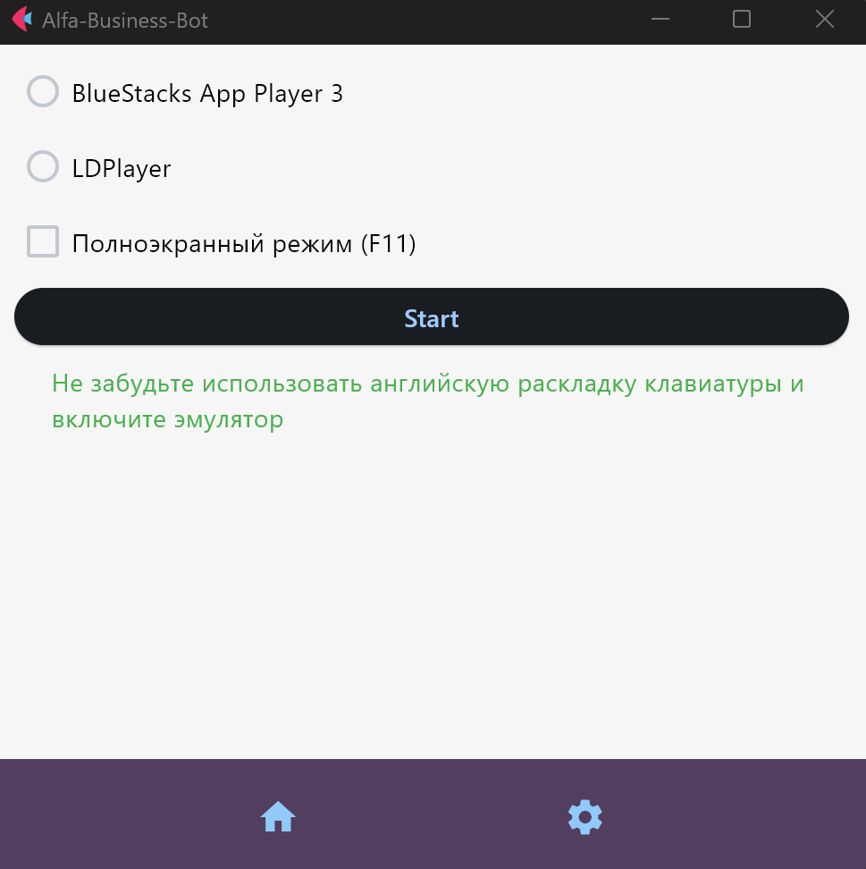

# Alfa Business Bot

Alfa Business Bot is a Python-based automation tool designed to interact with the Alfa Business Bank mobile application via an Android emulator on Windows. The bot leverages computer vision to enter and verify phone numbers, determining if a user exists within the application.
!!!Default pin code 1999!!!
!!!Russian Language interface!!!

## Features
- **Automated Interaction**: Uses an Android emulator to navigate the Alfa Business Bank mobile app.
- **Phone Number Verification**: Inputs phone numbers and checks for user existence.
- **Computer Vision**: Utilizes advanced image recognition to interact with the app's UI.

## Prerequisites
- **Python 3.11.4**
- **Android Emulator** (e.g., BlueStacks, NoxPlayer)
- **OpenCV** (for computer vision tasks)
- **PyAutoGUI** (for GUI automation)
- **Tesseract-OCR** (for text recognition)
- **etc ..**